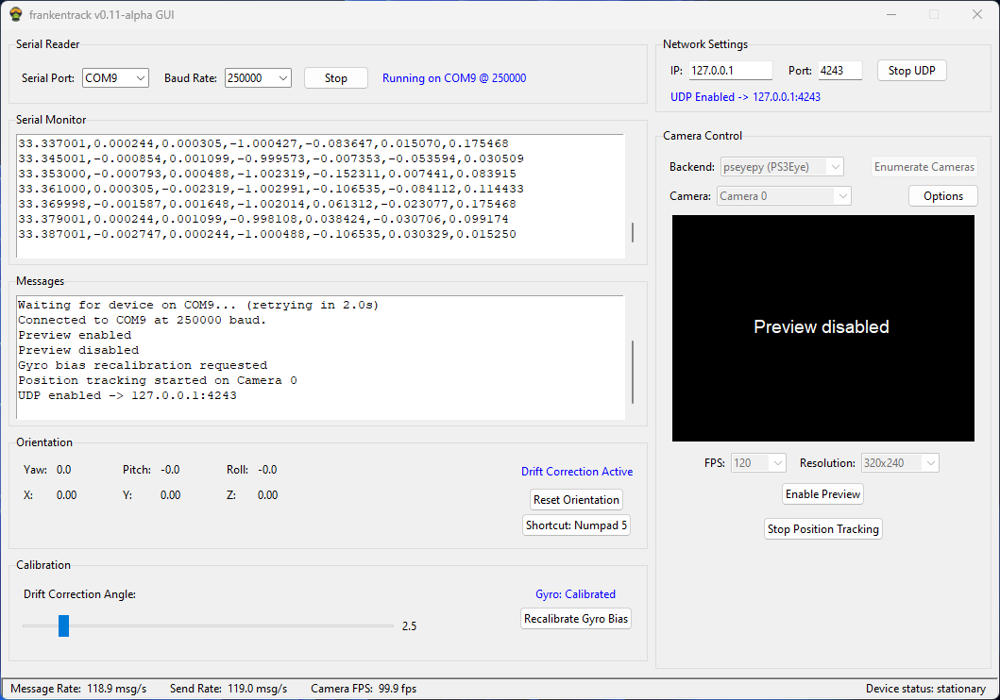

# Frankentrack

OpenTrack-compatible sensor fusor and UDP sender for 3DOF (Yaw/Pitch/Roll) headtracking, utilizing IMU data sensor fusion (accelerometer and gyroscope). Written in Python. 
Supports single-point IR-LED tracking for X/Y movement estimation. 

## What is Frankentrack? 

Frankentrack is the product of unholy union of IMU sensor data fusion and (optional) single-point IR-LED tracking to achieve a stable, responsive, precise, lightweight and cost effective 5DOF headtracking solution with a smaller physical footprint than traditional 3-point trackers.

Since it only processes data coming in over serial, a wide range of sensors and microcontrollers are supported. The only prerequisite is that incoming data must be structured in csv-style for parsing. More on that below. 

## Demonstration Video

<iframe width="560" height="315" src="https://www.youtube.com/watch?v=8bVocOTLqhI" frameborder="0" allow="accelerometer; autoplay; clipboard-write; encrypted-media; gyroscope; picture-in-picture" allowfullscreen></iframe>

## Project state

This is an early release and there might be bugs present. Contributions are welcome and will be welcomed with warm thanks. 

I also want to be transparent about the fact that this project has seen heavy AI assistant usage. While I tried to make smart decisions, I am happy to learn if someone human knows better. 

Nonetheless, thank you Claude. 

## Features

### Program Features
* Responsive and fast headtracking solution, supports sending at 120hz
* Modular gui for monitoring angles, drift correction status, stationarity and more
* Serial reader for receiving csv-structured IMU Sensor Data
* Sensor fusion using complementary filter to produce pitch/roll/yaw angles
* 2-step drift correction procedure for stable viewing angles
* Single brightspot optical tracking using a webcam to produce X/Y movement
* UDP sender for sending into opentrack
* Central log file
* Multiprocess architecture using queues for IPC

### Configuration
* Central configuration file for runtime constants (config/config.py)
* Central configuration file for user preferences (config/config.cfg)

### Drift Correction
* First step: Gyro drift estimation using configurable number of samples (do while stationary and level)
* Second step: Active, subtle drift correction while inside configurable area (effectively recentering)

## Installation

* Clone repository 
`git clone https://github.com/anmagx/frankentrack`

* Change into directory 
`cd frankentrack`

* Create .venv (optional, but recommended) 
`python -m venv .venv`

* Activate virtual environment 
`.venv\Scripts\activate`

* Install requirements.txt 
`python -m pip install -r requirements.txt`

* Launch program 
`python frankentrack.py`

## Requirements

**Software**

Python
* OpenCV (for camera handling)
* Pillow (camera preview handling)
* pyserial (serial reading)
* tkinter (gui)

**Hardware**

Basically anything that will give you csv-structured data over a serial port will work. The setup in the video uses the following components: 

* Arduino Nano
* MPU6500
* Single 940nm IR-LED (wired to 5V using 150Ohm Resistor)
* PS3 Eye camera

Required data structure:

`time(millis),accX,accY,accZ,gyrX,gyrY,gyrZ`

During tests, message rates of 120hz were absolutely fine, and you could probably go faster than that. However that might require adjusting the queue sizes in config.py, depending on performance.

**Camera Limitations**

The PS3 Eye camera is known to be tricky to utilize in python. The libusb-driver package for the PS3 eye can be used with opencv, but won't read frames beyond 60FPS. Perhaps the official CL Driver supports more, but as it's commercial, it is not used in this project. 

## Usage

Open the included arduino sketch and flash it to your Arduino Nano. Wire up your sensor as an I2C device and then connect via USB-C. 
(Optional: If you want to power your LED for Position tracking, the designated pin is D3.)

In the gui, set your preferred serial port and baud rate and click 'Start'. Make sure your device is sitting still and level.

After a short calibration period the sensor data will be available in the gui. You should next start the gyro bias calibration. After this has finished, the sensor is safe to be moved. If you fix it to your headset, you can recenter your view now and start the UDP sender (on whichever port you've set opentrack to receive in.)

When in game, you should set your preferred drift correction angle with the slider in the gui. More on that setting below. 

## Frequently asked Questions (FAQ)

### Why?

Professional IR tracking setups can be quite costly. There are ample ways to build your own though, with most of them utilizing some variation of the delan clip: 3 IR LEDs, offset relative to each other, and an IR sensitive camera (like the PS3 Eye) tracking them. These are proven and have years of community experience behind them, so if you're looking for a reliable solution, you're probably quite well off with one of those.

I personally just didn't like the way the clip was reaching into my field of view when wearing the headset. It feels bulky, which it needs to be: For precise movement recognition, you need some distance between those LEDs for the algorithm to be able to discern the angles clearly. Alternatively you can go with a smaller clip, but at the cost of sensitivity and accuracy. 

This project is an attempt at achieve stable and fast headtracking, but in a smaller physical package: IMUs (Like the MPU6050/6500) are tiny and can deliver surprisingly accurate accelerometer and gyroscope readings, and quite fast too. The provided example utilizing an Arduino Nano with a MPU6500 easily gets to 120Hz, and could probably go even faster.

### How are the orientation angles computed?

The yaw, pitch and roll angles are computed from accelerometer and gyroscope data using a comparatively simple complementary filter. Pitch and Roll are computed using the accelerometer values (with earth gravity being the reference point) plus the gyroscope for fast movements. Yaw is computed using gyroscope only, as we can't infer a true reference using gravity. As a consequence of this, yaw angle will naturally drift over time. The program implements 2 corrections for this: 

1. **Calibration**

    On pressing the calibration button, a configurable number of samples are collected. The sensor should be kept **still and level** during this time. These samples are used to compute a gyro bias, which is consequently and constantly applied to each sensor update. This cancels out drift, but due to small fluctuations in the drift rate, it can potentially introduce drift in the adverse direction. This is solved by:

2. **Conditional Drift correction using threshold angle**

     You can set your preferred drift correction threshold angle. You can think of it as a circle around your 0,0,0 point - whenever your view enters this circle, the angles are gradually and smoothly pulled back to 0,0,0, effectively smoothly recentering the view when you look straight ahead. This achieves quite stable results over long sessions. 

There are lots of sensor fusion algorithms out there which aim to correct this inherentyaw drift (e.g. Kalman, Madgwick, Mahony), but most of them rely on a 9DOF sensor package. In this case a magnetometer is included in the sensor to give a yaw reference using earths magnetic field. This however also increases complexity quite a bit, as well as potential for failure. Magnetometers are tricky to calibrate precisely and magnetic interference is everywhere, especially on top of a headset, where the sensor sits. This rather simple solution works quite well for this use case.

### How are X/Y positions calculated? 

As an optional feature, a simple single-point IR-LED tracking system is implemented. Using python-opencv, a wide range of cameras are supported, including the infamous PS3 Eye if you use the official driver. (Installation instructions linked here)

The camera tracks the LED point across the screen and estimates your movements to send to OpenTrack along with the orientation angles. 

### Why no Z-Movement? 

Z movement is tricky to implement using a single LED. While there are methods (blob size change detection or tracking of total LED brightness) these are quite prone to behave in an inconsistent manner as a result of the LED itself rotating. 

Rotating your head (to look at something) rotates the LED, the angle to the camera changes, and with it, light intensity. This causes head rotation to produce unwanted movement detections. 

Adding a second LED and tracking the midpoint between the two can somewhat remedy this. However, I did not get it to work in a satisfying and reliable manner, so the code doesn't support it. Since the main goal of the project is to minimize physical package size, it's a good tradeoff for now. 

### How does it functionally compare to a traditional 3-point tracking solution? 

Just from my experience, using completely self-built tracking hardware, there are some considerations and tradeoffs. 

**Responsiveness**

With Frankentrack, you're pretty much only limited by the number of sensor readings you can achieve per second, which can easily go into the hundreds - while with a more traditional 3-point tracking, your bottleneck will be the camera (framerate/inherent latency introduced by image processing/compression). With some careful calibration, you can get an incredibly responsive system. My example runs at about 120Hz. 

I've also found that with this solution I can get away with lower filter settings in opentrack, so for me the movement feels considerably less spongy.

**Precision**

In 3-point tracking, the precision of your solution hinges on the construction of your LED-clip and the angle of it to your camera. Wider distances between the LEDs offer more precise measurements, but increase overall package size and bulkiness. Also, since you tend to wear the clip on either the left or the right side, rotations may be more consistent in one direction than the other. 

Frankentrack is equally stable in each movement direction. The yaw drift is barely noticeable and blends in with the natural inconsistencies introduced by human movement. It is also recentered gradually each time you look straight ahead, leading to long term stability. 

**Consistency**

With 3-point tracking, I found that some orientations are quite tricky to hold - for example, looking down and moving around the yaw axis always tended to introduce some "wobble" which I couldn't quite get to go away. 

Using IMU angles, there are no angles that are more or less stable than others, and movement is smooth in all directions. 

**Tradeoffs**

Very fast movements can trip up the internal state of the sensor, leading to a desync of what the sensor expects it's starting position to be and what it actually is. This requires manual recentering, which can be done by the press of a button. 

In practice during normal play, I only had this happen when I tried to provoke it. 

The calibration phase is very important and must be run at each program startup. The sensor must be upright and relatively level to give precise measurements. While you could calibrate while wearing your headset, you would need to be incredibly still. I would suggest setting your system down for the short startup. 

Drift may be influenced by external factors like temperature or humidity, so the program allows recalibration at any time. After very long periods, the offsets internal to the sensor could be out of sync with changed external factors, requiring a sensor reboot. This of course entirely depends on how the sensor is programmed. 

[https://www.youtube.com/watch?v=8bVocOTLqhI]: https://www.youtube.com/watch?v=8bVocOTLqhI
